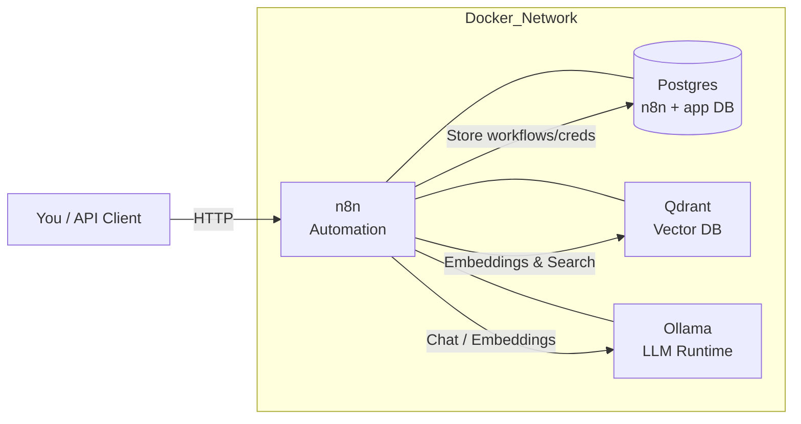

# AI Automation Stack 🚀

A **self-hosted AI & automation platform** running on **Docker Compose**, combining:

- [**n8n**](https://n8n.io) → workflow automation / orchestration  
- [**Postgres**](https://www.postgresql.org) → database backend for n8n + your own data  
- [**Qdrant**](https://qdrant.tech) → vector database for semantic search & RAG  
- [**Ollama**](https://ollama.ai) → local LLM runtime (run Llama 3.1, Mistral, Gemma, etc.)

---

## 🌐 What You Get
- **End‑to‑end automation** with n8n
- **Durable DB backend** (Postgres) + extra `app` database for your own tables
- **Vector storage** (Qdrant) for embeddings, semantic search, and RAG pipelines
- **Local LLM hosting** (Ollama) → pull any quantized 7B/8B model and query it
- **Secure configuration** via `.env` (kept out of Git; `example.env` provided)
- **Extensible design** → add Watchtower or Ansible later for ops/updates

---

## 🧑‍💻 Why This Repo Matters
- **Infra‑as‑Code** with Docker Compose  
- **Automation** (n8n) + **data** (Postgres) + **AI** (Ollama) + **RAG** (Qdrant)  
- **Security‑aware** (env‑driven, encryption key, API key)  
- Clean, extensible foundation for portfolios and real projects

---

## 🧭 Architecture (high‑level)



---

## 🛠 Prerequisites
- [Docker Desktop](https://www.docker.com/products/docker-desktop/) (Windows/Mac) or Docker Engine (Linux)
- `git` installed
- ~15 GB free disk (containers + a model or two)

---

## 📂 Folder Structure

ai-automation-stack/
├─ docker-compose.yml       # Main stack definition
├─ .env                     # Your private secrets (ignored in Git)
├─ example.env              # Template for others to copy
├─ db-init/
│  └─ 01-create-app-db.sql  # Initializes extra 'app' database
└─ .gitignore


---

## 🚀 Quick Start (Local)

### 1) Clone
```bash
git clone https://github.com/tjas01/ai-automation-stack.git
cd ai-automation-stack
```

### 2) Create `.env` from the template
**Windows (PowerShell):**
```powershell
copy example.env .env
```
**macOS/Linux:**
```bash
cp example.env .env
```

Edit `.env` and set your values (see **Config** below).

### 3) Launch
```bash
docker compose up -d
docker compose ps
```

### 4) Open
- **n8n** → http://localhost:5678  
- **Qdrant UI/API** → http://localhost:6333 *(requires API key header)*  
- **Ollama API** → http://localhost:11434

> First run of n8n: create the owner account in the UI.

---

## 🔑 Config

Your secrets live in `.env`. The template (`example.env`) includes commented keys.

```ini
# ---- Postgres ----
POSTGRES_USER=your_user
POSTGRES_PASSWORD=your_password
POSTGRES_DB=n8n

# ---- n8n ----
N8N_HOST=localhost
N8N_PORT=5678
N8N_BASIC_AUTH_ACTIVE=true
N8N_BASIC_AUTH_USER=your_n8n_login
N8N_BASIC_AUTH_PASSWORD=your_n8n_password
# Used to encrypt credentials stored by n8n (set BEFORE creating creds):
N8N_ENCRYPTION_KEY=CHANGE_ME_LONG_RANDOM_KEY

# ---- Qdrant ----
QDRANT_HTTP_PORT=6333
QDRANT_GRPC_PORT=6334
QDRANT_API_KEY=your_qdrant_api_key_here

# ---- Ollama ----
OLLAMA_PORT=11434
```

**Notes**
- Choose strong passwords if exposing beyond localhost.  
- Keep `.env` out of Git (already in `.gitignore`).  
- `N8N_ENCRYPTION_KEY` should be set **before** creating any Credentials in n8n.

---

## 🤖 Pick & Run an LLM (Ollama)

Pull a model (example: **Llama 3.1 – 8B**):

```bash
docker exec ai_ollama ollama pull llama3.1:8b
docker exec ai_ollama ollama list
```

Quick test:
```bash
curl http://localhost:11434/api/generate -d '{
  "model": "llama3.1:8b",
  "prompt": "Say hi to Tejas."
}'
```

### Optional: Custom instructions (Modelfile)
Create a personalized model with a `Modelfile`:

```yaml
FROM llama3.1:8b
NAME llama-tejas
SYSTEM """
You are LlamaTejas, helpful and concise.
Always greet Tejas first.
"""
```

Build & run:
```bash
# Put Modelfile inside Ollama's models dir or mount it, then:
docker exec ai_ollama ollama create llama-tejas -f /root/.ollama/Modelfile
docker exec ai_ollama ollama run llama-tejas
```

---

## 🔗 Wire the Services in n8n

### Postgres (your `app` database)
- **Host:** `db`  
- **Port:** `5432`  
- **Database:** `app`  
- **User/Password:** from `.env`  
- **SSL:** Off for local

### Qdrant (official node or HTTP)
- **Base URL:** `http://qdrant:6333`  
- **Auth:** Header `api-key: <QDRANT_API_KEY>`  
- Use **Qdrant** / **Qdrant Vector Store** node to upsert/search vectors.

### Ollama
- **Base URL:** `http://ollama:11434`  
- **Model:** `llama3.1:8b` (or your custom)  
- Use the **Ollama** node for Chat/Generate/Embeddings.

> In Docker, always use service names (`db`, `qdrant`, `ollama`) from n8n, not `localhost`.

---

## 🔒 Security (read before going public)
- Change defaults in `.env` to strong secrets.
- Don’t expose ports directly to the internet. Use a reverse proxy (Caddy/Traefik/Nginx) with **HTTPS** + **Basic Auth**.
- Restrict access with firewalls/VPN.  
- Consider Docker secrets or Ansible Vault for production secrets.  
- Qdrant: keep `QDRANT__SERVICE__API_KEY` enabled; rotate keys periodically.

---

## ♻️ Updates & Disk Cleanup
Update images and restart:
```bash
docker compose pull
docker compose up -d
```

Remove old, unused image layers:
```bash
docker image prune -f          # safe: dangling only
# or stronger (be careful):
# docker system prune -a
```

Stop:
```bash
docker compose down
```

Reset (wipe all volumes/data):
```bash
docker compose down -v
```

---

## ❗ Troubleshooting
- **n8n can’t reach Ollama/Qdrant:** In credentials, use `http://ollama:11434` / `http://qdrant:6333` (service names).  
- **Qdrant 401:** Add header `api-key: <QDRANT_API_KEY>`.  
- **DB init didn’t run:** You started once without `db-init` mounted; run `docker compose down -v` and start again.

---

## 📜 License
MIT — free for personal and professional use.
